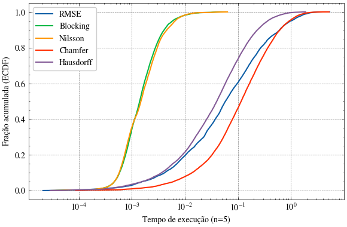
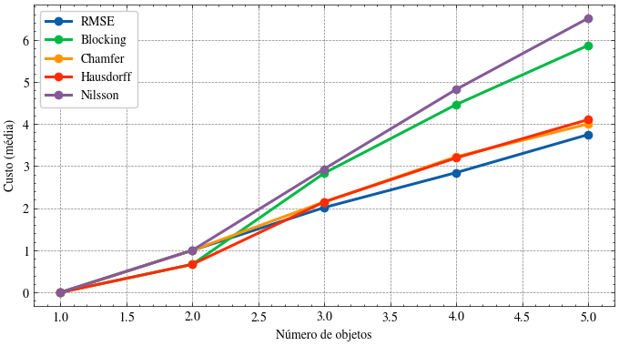
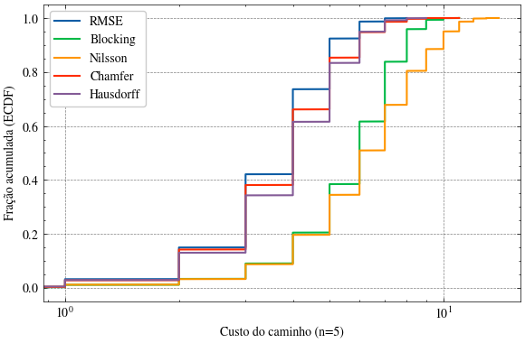

## 1. Especificação do Problema

O **Problema do Mundo de Blocos (Block World)** é um problema clássico de planejamento em IA que envolve reorganizar blocos numerados distribuídos em pilhas para atingir uma configuração objetivo a partir de um estado inicial.

Essa solução foi desenvolvida por **Emily de Britto Gomes**, **Gabriel Chaves Aguiar** e **Matheus Henrique Pereira Borba**.

### 1.1. Representação do Estado

O estado atual e o estado objetivo são representados como uma **lista de listas**, onde cada sublista representa uma pilha de blocos:

```
Estado: [[], [1], [2, 3]]
```

Interpretação:
- Pilha 0: vazia
- Pilha 1: contém bloco 1
- Pilha 2: contém blocos 2 e 3 (3 está no topo)

### 1.2. Definição de Ações

Uma ação é **mover um bloco do topo de uma pilha para outra pilha**. 

Pré-condição: O bloco deve estar no topo de sua pilha atual
Efeito: Remove o bloco da pilha atual e o adiciona no topo da pilha destino

Exemplo:
```
Estado inicial:  [[], [1], [2, 3]]
Ação: Mover bloco 3 de Pilha2 para Pilha0
Estado novo:    [[3], [1], [2]]
```

### 1.3. Método de `is_goal`

Uma observação importante é que a quantidade de pilhas é a mesma quantidade do número $n$ de objetos. Isso foi feito porque, caso fosse maior, apenas iria aumentar a árvore de busca desnecessariamente.
Porém, com uma quantidade de pilhas menor ou igual a $n$, ainda pode ser impossível resolver o problema. Por exemplo:
```
Estado inicial:  [[], [1, 2]]
Estado objetivo:    [[1, 2], []]
```
Diante disso, consideramos que a ordem de pilhas não importa para que exista solução sempre.


### 1.4. Definição de Custo

Cada movimento tem **custo unitário = 1**. O custo total da solução é a quantidade de movimentos realizados.

---

## 2. Heurísticas Selecionadas

### 2.1 RMSE
A heurística RMSE representa o estado como uma matriz binária A(s) de tamanho n x n, onde cada posição indica a ocupação de um bloco na coordenada (pilha, altura).

A comparação com o objetivo A(g) é feita por:

$$
h(s) = \sqrt{\frac{1}{n^2} \sum_{i,j} \left( A(s)_{ij} - A(g)_{ij} \right)^2}
$$

Essa heurística mede a diferença estrutural global entre estado e objetivo.

---

### 2.2 Blocking
A heurística Blocking soma, para cada bloco b:

$$
h(s) = \sum_{b \in B} \left( \mathbf{1}_{pos(b) \neq pos_g(b)} + \text{above}(b) \right)
$$

A ideia é que um bloco só pode ser movido se estiver no topo, então blocos bloqueados exigem movimentos adicionais.

---

### 2.3 Nilsson
A heurística Nilsson é uma versão ponderada da Blocking:

$$
h(s) = \sum_{b \in B} \left( 3 \cdot \mathbf{1}_{pos(b) \neq pos_g(b)} + 2 \cdot \text{above}(b) \right)
$$

Ela penaliza mais fortemente blocos fora do lugar e bloqueios.

---

### 2.4 Chamfer
A heurística Chamfer modela o estado como um conjunto de pontos:

$$
S = \{(i,j)\}, \quad G = \{(i,j)\}
$$

$$
d(p, G) = \min_{q \in G} \|p - q\|
$$

$$
h(s) = \frac{1}{|S|} \sum_{p \in S} d(p, G)
     + \frac{1}{|G|} \sum_{q \in G} d(q, S)
$$

Ela mede o desalinhamento médio entre as estruturas dos estados.

---

### 2.5 Hausdorff
A heurística Hausdorff também usa conjuntos de pontos, mas considera o pior caso:

$$
h(s) = \max \left(
    \max_{p \in S} d(p, G),
    \max_{q \in G} d(q, S)
\right)
$$

Ela captura o maior erro estrutural entre estado e objetivo, focando na discrepância máxima.


---

## 3. Algoritmo A*

O algoritmo A* foi implementado usando a biblioteca `aigyminsper` com a estratégia de pruning "father-son" para evitar ciclos.

A* utiliza: $f(n) = g(n) + h(n)$
- $g(n)$: custo real do caminho do nó inicial ao nó n
- $h(n)$: estimativa heurística do nó n até o objetivo

---

## 4. Casos de teste

Um arquivo `tests.py` foi implementado para capturar todas as possíveis combinações de um problema com $n$ objetos. Essas diferentes formas de organizar o bloco podem ser calculadas da seguinte forma:

Resolva o problema das partições ordenadas:

$$
x_1 + x_2 + x_3 + \dots + x_n = n
$$

Quantidade de soluções:

$$
\binom{2n - 1}{n - 1}
$$

Considerando que os objetos são distintos, multiplicamos por $n!$:

$$
\binom{2n - 1}{n - 1} \cdot n!
$$

Diante disso, podemos calcular a quantidade de casos para cada $n$ de 1 a 5:
|  n  | Quantidade |
|:---:|-----------:|
|  1  |          1 |
|  2  |          6 |
|  3  |         60 |
|  4  |        840 |
|  5  |      15120 |

Totalizando $16027$ casos de teste para cada heurística. No entanto, como testamos 5, rodamos um total de $80135$ casos de pares estado inicial - estado objetivo.

---

## 5. Resultados encontrados

### 5.1. Tempo de Execução (ECDF)

<p align="center">

</p>

Este gráfico apresenta o tempo de execução dos algoritmos para 5 objetos.

### Análise:
- **Blocking** e **Nilsson** são significativamente mais rápidos (curvas sobem rapidamente).
- **RMSE** e **Hausdorff** possuem desempenho intermediário.
- **Chamfer** é o mais lento entre os métodos.

---

### 5.2. Custo Médio por Número de Objetos

<p align="center">

</p>

Este gráfico mostra o custo médio conforme o número de objetos aumenta.

#### Análise:
- Todos os métodos apresentam aumento de custo com mais objetos.
- **RMSE** apresenta o menor crescimento.
- **Blocking** e **Nilsson** crescem mais rapidamente.
- **Chamfer** e **Hausdorff** têm comportamento intermediário.

### 5.3. Custo do Caminho (ECDF)

<p align="center">
  
</p>

Este gráfico mostra a função de distribuição acumulada (ECDF) do custo do caminho.

#### Análise (distribuição dos dados):

- **RMSE, Hausdorff e Chamfer** apresentam uma subida mais abrupta na ECDF, indicando que os custos estão **mais concentrados** em uma faixa estreita (baixa variabilidade).

- **Blocking e Nilsson** possuem curvas mais espalhadas, sugerindo **maior variância** nos custos — ou seja, resultados menos consistentes.

- A inclinação da curva revela a consistência do método:
  - Curvas mais íngremes → resultados mais previsíveis
  - Curvas mais suaves → maior dispersão dos custos

---

## 5.4. Conclusão Geral

| Método     | Custo        | Tempo        | Observação                     |
|-----------|-------------|-------------|--------------------------------|
| RMSE      |  Baixo     |  Médio/alto     | Melhor equilíbrio geral        |
| Blocking  |  Alto      |  Rápido     | Rápido, porém caro             |
| Nilsson   |  Alto      |  Rápido     | Similar ao Blocking            |
| Chamfer   |  Médio/baixo     |  Lento      | Muito lento, custo médio       |
| Hausdorff |  Médio/baixo     |  Médio/alto     | Equilíbrio intermediário       |


---

## 6. Admissibilidade das Heurísticas

### 6.1. Premissas
- Estado objetivo: `state == goal`. Não foi exatamente assim que modelamos, mas o jeito que fizemos foi apenas para reduzir a árvore de busca. Considere que o método considera a ordem para a análise abaixo.
- Custo por ação: 1
- Heurística admissível se:
  
$$
\forall s,\; h(s) \leq h^*(s) \quad \text{e} \quad h(goal)=0
$$

---

### 6.2. RMSE

Definição:

$$
h(s)=\sqrt{\frac{1}{n^2}\sum_{i,j}(A(s)_{ij}-A(goal)_{ij})^2}
$$

Como $A(s)_{ij} \in \{0,1\}$:

$$
0 \leq h(s) \leq 1
$$

Se $s = goal$:

$$
h(goal)=0
$$

Se $s \neq goal$:

$$
h^*(s) \geq 1
$$

Logo:

$$
h(s) \leq 1 \leq h^*(s)
$$

Conclusão: **admissível**.

---

### 6.3. Blocking

Para cada bloco $b_k$ fora da posição:

$$
h = \sum_{k} \left(1 + \text{blocos acima de } b_k\right)
$$

Considere:

$$
S_m = [[b_1, b_2, \dots, b_m], \emptyset, \dots]
$$

$$
G_m = [[b_1], [b_2], \dots, [b_m], \emptyset, \dots]
$$

Custo ótimo:

$$
h^*(S_m) = m-1
$$

Heurística:

$$
h(S_m) = \sum_{k=2}^{m} (1 + (m-k))
$$

Mudando variável $r = m-k$:

$$
h(S_m) = \sum_{r=0}^{m-2} (1 + r)
= \frac{m(m-1)}{2}
$$

Para $m \geq 3$:

$$
\frac{m(m-1)}{2} > m-1
$$

Conclusão: **não admissível**.

---

### 6.4. Nilsson

Definição:

$$
h = \sum_{k} \left(3 + 2 \cdot \text{blocos acima}\right)
$$

Mesmo cenário:

$$
h(S_m) = \sum_{k=2}^{m} (3 + 2(m-k))
$$

Com $r = m-k$:

$$
h(S_m) = \sum_{r=0}^{m-2} (3 + 2r)
$$

$$
= 3(m-1) + (m-2)(m-1)
$$

$$
= (m-1)(m+1) = m^2 - 1
$$

Como:

$$
h^*(S_m) = m-1
$$

Para $m \geq 2$:

$$
m^2 - 1 > m-1
$$

Conclusão: **não admissível**.

---

### 6.5. Chamfer

Definição:

$$
h(s) = \frac{1}{|S|}\sum_{p \in S} d(p, G) + \frac{1}{|G|}\sum_{q \in G} d(q, S)
$$

Considere:
- estado: ponto $(0,0)$
- objetivo: ponto $(k,0)$

Então:

$$
h(s) = k + k = 2k
$$

Mas:

$$
h^*(s) = 1
$$

Para $k \geq 1$:

$$
2k > 1
$$

Conclusão: **não admissível**.

---

### 6.6. Hausdorff

Definição:

$$
h(s) = \max\left(\max_{p \in S} d(p,G), \max_{q \in G} d(q,S)\right)
$$

Mesmo cenário:

$$
h(s) = k
$$

Mas:

$$
h^*(s) = 1
$$

Para $k \geq 2$:

$$
k > 1
$$

Conclusão: **não admissível**.
